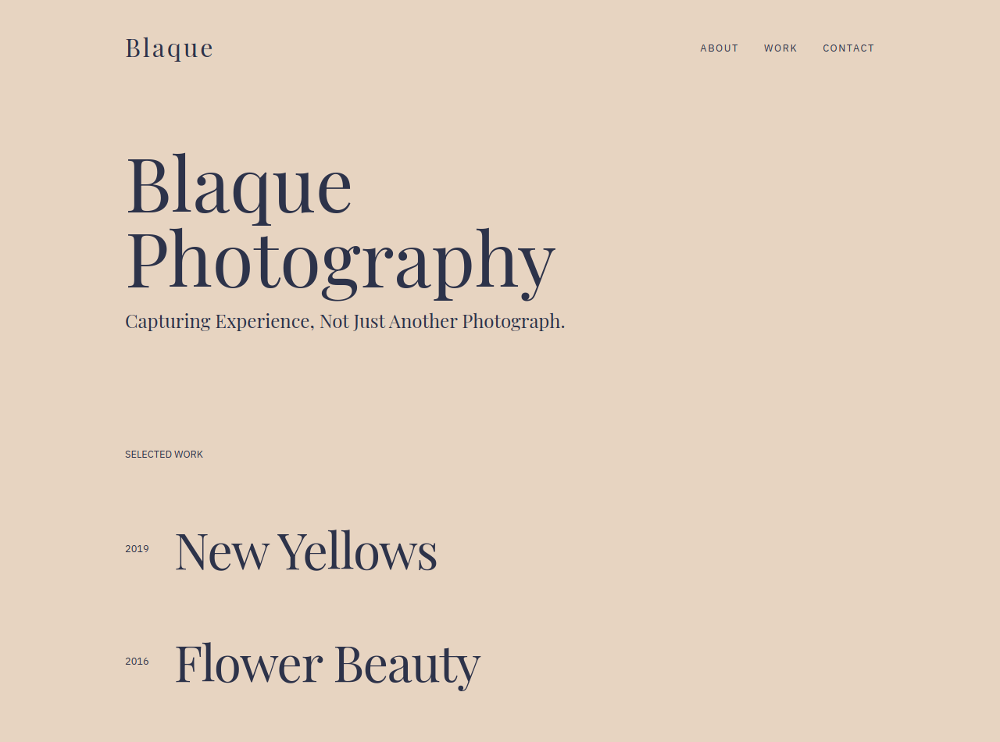

## purpose and goal

After my entry [link to eleventy duo] into the Jamstack with eleventy, I wanted to learn another static site generator.

I decided to learn Gatsby, a React-based static site generator because it's very popular, heard great things about it and I already know ReactJS.

The docs are great and easy to understand and there's a lot of tutorials online and lots of open-source gatsby projects to review and learn from.

Around that time, too, my friend, an enthusiastic photographer, wanted a portfolio website. One that's beautiful and can be easily edited as a non-technical person.

A perfect opportunity for me to make use of my Gatsby knowledge.

## general requirement

The requirement I had in mind is that the website must be fast and responsive, have some simple animations, and easy to edit for a non-technical person.

## stack explanation

After checking several headless cms, I decided to choose Prismic because of its simple and intuitive content editor and its generous pricing.

I wanted the site to have some simple animation too, I used Framer Motion for that.

CSS in js is my go-to for styling in React apps. Great things have been said about it already, and my preferred tool for that is Styled-components, mainly because it lets you write actual CSS and it's popular.

## challenges

GatsbyJS surprisingly took longer than expected to get hold of because I had to learn graphql, after some googling and tinkering, I finally grasped GraphQL.

# wrapping up

I was able to use Gatsby in a real-world project and I learned to integrate Gatsby with a headless CMS.
