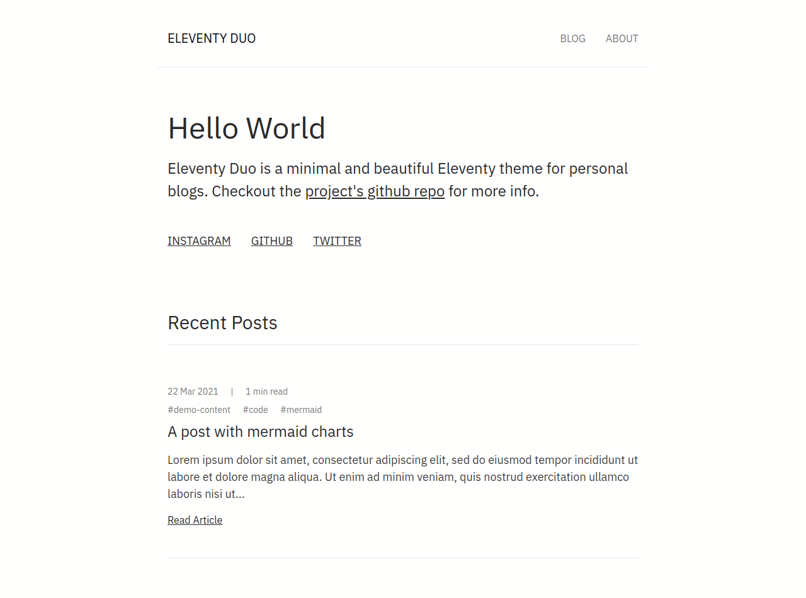

## purpose and goal

I just ventured into Jamstack and wanted to start simple, so, I decided to learn [Eleventy](https://www.11ty.dev) - a simple javascript powered static site generator.

After reading the docs and several tutorials on the web and creating a few sample eleventy projects. I decided to build an eleventy project to make use of my eleventy knowledge.

Eleventy Duo is the resulting project - a minimal and beautiful eleventy starter for personal blogs.

## general requirement

I had a few requirements in mind to be able to call this project a success.

Apart from the bare minimum that the generated website must be fast and responsive.

The user interface should be minimal and beautiful.

It should also be easy for others to customize and build upon the project

And non-technical users should be able to add and update the site content.

## stack explanation

Since the project is a personal blog starter, Eleventy is ideal for a simple site like this. It's easy to set up and fast and flexible for customization.

Used Webpack for asset bundling and Postcss for CSS processing.

Coupled with forestry cms out of the box to enable site editing for non-technical users.

## challenges

It was fairly easy building the project. This was my first open-source project, I found it difficult to write documentation to use the project. After a lot of googling and checking other projects readme, I ended up with a good readme.

## wrapping up

This project was a series of firsts for me - my entry into the Jamstack world, the first opensource project.

I solidified my eleventy knowledge, learned Nunjucks, improved on using git.

People found the project useful and a few folks have contributed to the project.
