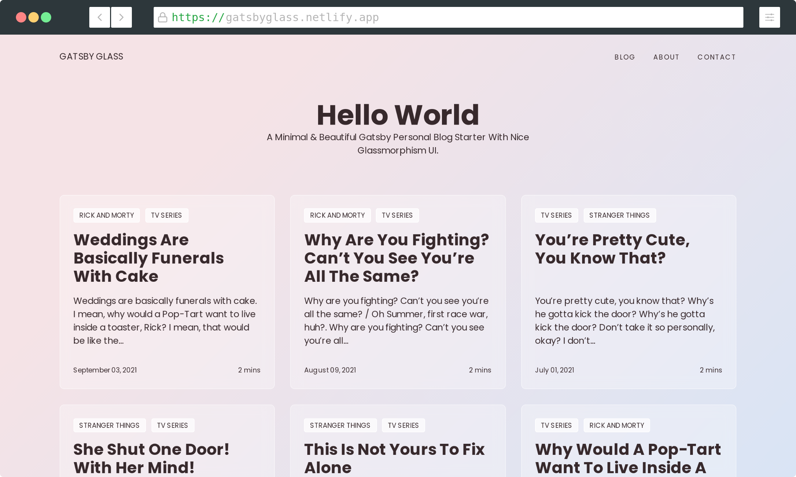

## Project Purpose and Goal

This project included 3 phases and iterations of the site. Phase 1 simply allowed users to enter their email to be alerted to when the product was released. Phase 2 was quite larger and is designed to introduce users to the Coffee By Benjamin product and answer any questions they may have. Phase three is by far the largest and most complex, as it includes the full shop and cart pages as well as the logic and backend that goes along with it.

I found that the best way to implement these 3 phases without having separate versions saved was to incorporate a feature flag that will pass the current state that should be displayed and then render content conditionally.

